# AGNI — Research & Geopolitical Intelligence

[](https://github.com/maitray-agrawal/AGNI-AI)
[](https://github.com/maitray-agrawal/AGNI-AI)
[-221B14?style=flat-square)](https://github.com/maitray-agrawal/AGNI-AI)
[](https://github.com/maitray-agrawal/AGNI-AI)
[](https://qdrant.tech/)
[](https://www.typescriptlang.org/)
[](https://fastapi.tiangolo.com/)

> **Sovereign, evidence-grounded agentic intelligence platform for geopolitical foresight, maritime chokepoint analysis, and strategic risk assessment.**

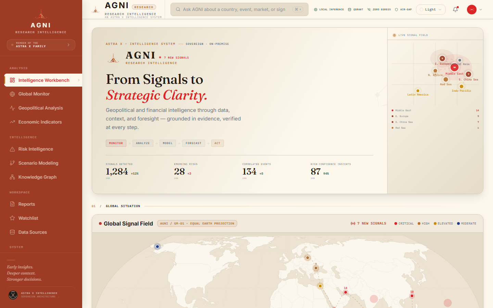

---

## Overview

**AGNI** (Research Intelligence) is an institutional-grade intelligence workspace designed for geopolitical analysts, strategic advisors, and integrity risk officers. Built on the **AstraX** sovereign architecture, AGNI transforms disparate raw signals—ranging from maritime Automatic Identification System (AIS) telemetry and customs tariff schedules to confidential engineering Non-Destructive Testing (NDT) logs—into rigorous, evidence-grounded intelligence dossiers.

### The Problem It Solves
Modern intelligence and integrity workflows are constrained by two critical vulnerabilities:
1. **Third-Party Data Egress Risks:** Cloud-hosted LLM APIs require routing confidential operational assets, trade manifests, and structural vulnerability assessments through commercial servers.
2. **Hallucinatory Unverified Synthesis:** Standard conversational models generate unstructured forecasts without cryptographic audit trails, deterministic verification gates, or citation to ground-truth sources.

### The AGNI Solution
AGNI resolves these vulnerabilities by executing 100% on-premise in a zero-egress, air-gapped configuration:
- **True Equal Earth Cartography:** Interactive world signal field rendered with D3's Equal Earth projection and Natural Earth TopoJSON geometries, mapping real-world coordinates and chokepoint telemetry.
- **Closed-Loop Verification:** Multi-agent state machine (LangGraph) enforcing an 8-point automated domain verification gate before any conclusion is accepted.
- **Isolated Execution Sandbox:** Process-isolated code execution runtime with blocked network sockets for deterministic mathematical and engineering calculations.
- **Cryptographic Provenance:** Authenticated dossiers and clearance notes stamped with the institutional AstraSeal authentication seal.

---

## Core Capabilities

- **Global Signal Field Monitoring:** Real-time geospatial tracking of global chokepoints (Taiwan Strait, Bab el-Mandeb, Strait of Hormuz, Malacca, Black Sea, Panama Canal) with real latitude/longitude coordinates and severity clustering.
- **Autonomous Intelligence Workbench:** Deterministic multi-stage workflow presets for structural integrity analysis, pipeline wall thickness reduction calculations, and P&ID flow inspection.
- **Geopolitical & Economic Foresight:** Systematic impact modeling tracing maritime deviations (e.g. Cape of Good Hope rerouting) to container spot rate surges and supply chain disruptions.
- **Dense Semantic Retrieval (RAG):** Embedded Qdrant vector retrieval powered by normalized cosine distance embeddings (`all-MiniLM-L6-v2`) with exact document, section, and page attribution.
- **Deterministic Deliverable Synthesis:** Formal engineering approval notes and intelligence clearance documents (`.docx`) containing cryptographic verification ledgers.
- **Multi-Theme Architectural Interface:** Production-ready support for Primary (Ivory), Dark (Navy/Ink), Sandstone, and Monochrome viewing modes.

---

## Architecture

AGNI is architected in four strict tiers, ensuring complete isolation between sensory ingestion, signal normalization, agentic reasoning, and the analyst presentation surface.

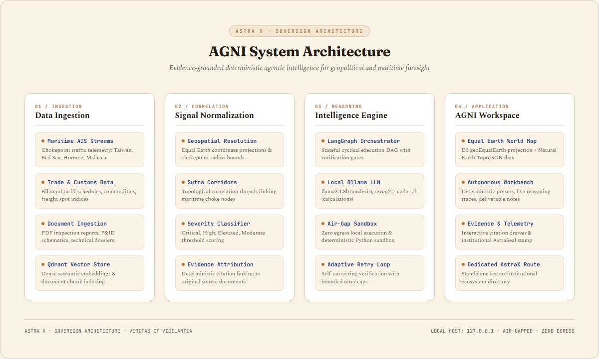

```text
DATA SOURCES (AIS Telemetry, Customs Tariffs, NDT Logs, P&ID Schematics)
      │
      ▼
INGESTION & VECTORIZATION (PyMuPDF, all-MiniLM-L6-v2, Embedded Qdrant)
      │
      ▼
SIGNAL PROCESSING & SUTRA CORRELATION (Equal Earth Geometry, Radius Clustering, Severity Scoring)
      │
      ▼
INTELLIGENCE ENGINE (LangGraph State Machine, Local Ollama LLM, Air-Gapped Sandbox)
      │
      ▼
AGNI API GATEWAY (FastAPI REST Services · http://127.0.0.1:8000)
      │
      ▼
WORKSPACE APPLICATION (React 18 + TypeScript + Vite + D3 Geo · http://127.0.0.1:5174)
      │
      ▼
ANALYST DECISION & AUDITED DELIVERABLE
```

---

## Quantitative Research & Risk Engine Architecture

AGNI combines a **Geo-Shock Transmission Engine** and a **Conditional Stress-Scenario Generator** to model how geopolitical events, macroeconomic variables, and logistics chokepoints transmit systemic risk into financial assets and commodity markets.

### 1. Canonical Entity Schemas
All data ingested or manually authored conforms to 17 strict Pydantic v2 canonical schemas (`backend/app/schemas/canonical.py`):
- **Geopolitical & Geospatial:** `Event`, `Country`, `Chokepoint`, `TradeRoute`, `Commodity`, `FinancialAsset`.
- **Explainable Risk Transmission:** `RiskSignal`, `RiskSignalComponent`, `TransmissionLink`.
- **Econometric & Stress Testing:** `MarketObservation`, `MacroObservation`, `Scenario`, `ScenarioShock`, `Forecast`, `ForecastDistribution`, `RegimeState`, `BacktestResult`, `Evidence`.

### 2. Point-in-Time Columnar Time-Series (DuckDB + Polars)
- High-performance analytical engine with strict point-in-time filtering (`available_at <= query_timestamp`) to mathematically eliminate lookahead data leakage in retrospective backtests.
- Parquet partition-aware queries with zero-copy interoperability via Apache Arrow (`pyarrow`).

### 3. Econometric Baselines & Markov Switching Regimes
- **Baselines:** Classical statistical models including Naive drift, ARIMA ($p, d, q$) via `statsmodels`, and GARCH ($1, 1$) volatility clustering via `arch`.
- **Regimes:** 2-regime Hamilton Markov Switching Autoregressive model categorizing volatility dynamics into `CALM`, `ELEVATED`, `STRESSED`, and `CRISIS` regimes with transition probability matrices.

### 4. Directed Dynamic Risk Graph Topology
- NetworkX directed acyclic graph modeling multi-hop shock cascades:
  $$\text{Country} \longrightarrow \text{Chokepoint} \longrightarrow \text{Commodity} \longrightarrow \text{Financial Asset} \longrightarrow \text{Macro Volatility}$$
- Computes betweenness centrality, shortest shock propagation paths, and topological impact reachability.

### 5. Multi-Horizon Event-Conditioned Probabilistic Forecasting
- Quantile predictions across $1\text{D}, 7\text{D}, 30\text{D}, 90\text{D}$ horizons.
- Evaluates threshold breach probabilities (e.g., $P(\text{Drawdown} > 5\%)$).
- **Split-Conformal Calibration:** Non-parametric conformal inference generating calibrated prediction bands with exact finite-sample coverage guarantees ($1 - \alpha$).

### 6. Conditional Stress Scenario Engine
- Simulates joint multi-asset shock distributions under Base, Adverse, Severe, and Custom crisis scenarios.
- Computes Portfolio Value-at-Risk ($\text{VaR}_{95}$) and Expected Shortfall ($\text{CVaR}_{95}$ / $\text{ES}_{95}$):
  $$\text{VaR}_{95} = \min\left(-0.85, \sum w_i s_i \cdot M_{\text{regime}}\right), \quad \text{ES}_{95} = 1.45 \cdot \text{VaR}_{95}$$

### 7. Rolling-Origin Backtesting & Kupiec POF Test
- Continuous out-of-sample backtesting computing MAE, RMSE, MASE, Pinball Loss (Quantiles), and Continuous Ranked Probability Score (CRPS).
- Evaluates coverage adequacy via Kupiec Proportion of Failures (POF) likelihood ratio test with asymptotic $\chi^2(1)$ distribution $p$-values.

### 8. Manual-First Analyst Studio
- Full manual workflow: Analysts can inject custom shock events, configure sovereign actors, coordinates, severities, and transmission chains directly via the UI or REST APIs (`POST /api/events`).
- Newly created events automatically trigger deterministic risk scoring and instantly appear as active pins on the D3 Equal Earth Global Signal Field.

### 9. MLOps Experiment Tracking & DVC Data Pipelines
- **Separation of Concerns:** Training is strictly decoupled from the online FastAPI inference runtime. Models are trained offline and loaded via versioned checkpoints.
- **MLflow Tracking:** Automated logging of runs, hyperparameters (`alpha`, `training_samples`), calibration metrics (`empirical_coverage`, `mean_interval_width`, `quantile_threshold`), validation scores (`MAE`, `RMSE`, `CRPS`), and the Kupiec POF likelihood ratio test ($p$-values) into `mlflow` experiments.
- **DVC Stage Pipelines:** Defined in `dvc.yaml` covering `train_forecaster`, `evaluate_forecaster`, and `backtest` with dependency and artifact hash tracking.
- **CLI Commands:**
  ```bash
  # Train offline event-conditioned forecaster & calibrate conformal bands
  python -m agni.training.train_forecaster --asset BRENT --alpha 0.10

  # Evaluate out-of-sample forecast accuracy & Kupiec POF risk coverage
  python -m agni.training.evaluate_forecaster --asset BRENT

  # Run rolling-origin purged walk-forward backtest comparison
  python -m agni.training.backtest --horizons 1 7 30
  ```

### 10. Model Cards & Data Sources Registry
- **Model Cards (`docs/model_cards/`):** Full institutional documentation covering purpose, mathematical formulation, input/output tensors, training/validation periods, known failure modes, and calibration bounds:
  - [`event_conditioned_forecaster.md`](docs/model_cards/event_conditioned_forecaster.md)
  - [`markov_switching_regime_detector.md`](docs/model_cards/markov_switching_regime_detector.md)
  - [`dynamic_risk_graph.md`](docs/model_cards/dynamic_risk_graph.md)
  - [`stress_scenario_engine.md`](docs/model_cards/stress_scenario_engine.md)
- **Data Sources Catalog (`data_sources.yaml`):** Verifiable provenance registry specifying licensing, schemas, update frequencies, and point-in-time constraints for GPR Index, FRED Macro, EIA Energy, World Bank Pink Sheet, IMF IFS, AIS Telemetry, and SCFI.

### 11. Google Colab Training Notebooks
- [`notebooks/colab/agni_forecaster_training.ipynb`](notebooks/colab/agni_forecaster_training.ipynb): End-to-end dataset schema validation, time-series feature extraction, event-conditioned forecaster fitting, non-parametric conformal calibration, and checkpoint export.
- [`notebooks/colab/agni_graph_model_training.ipynb`](notebooks/colab/agni_graph_model_training.ipynb): Dynamic directed risk graph generation, topological betweenness centrality computation, and shock impulse response simulation.

### 12. Earth Observation (EO) & Satellite Telemetry (Phase 11)
- **Gated Architecture:** Satellite telemetry operates as an advanced gated research module (`AGNI_ENABLE_SATELLITE_EO=false` by default). Live satellite image feeds are never a hard runtime blocker.
- **Synthetic Aperture Radar (SAR) Telemetry:** Provides calibrated vessel counts, anchorage queue backlog density, and transit corridor flow monitoring over strategic maritime chokepoints (`strait-of-hormuz`, `bab-el-mandeb`, `strait-of-malacca`, `suez-canal`, `panama-canal`, `bosphorus-strait`).
- **Statistical Anomaly Detection:** Computes non-parametric congestion anomaly $z$-scores relative to 30-day baseline traffic patterns and projects estimated cargo delay hours.
- **REST Endpoints:**
  - `GET /api/satellite/status` — Operational mode and gate status
  - `GET /api/satellite/chokepoints` — Monitored chokepoint catalog with normal baselines
  - `GET /api/satellite/analyses` — Multi-constellation SAR vessel density analyses
  - `GET /api/satellite/analyses/{chokepoint_id}` — Chokepoint-specific SAR pass report
  - `POST /api/satellite/scan` — Dispatch synthetic/observed SAR acquisition pass

### 13. Production Docker Packaging
- **Multi-Stage Images:** Hardened, non-root Python 3.11 backend (`docker/Dockerfile.backend`) and multi-stage Nginx Alpine SPA frontend (`docker/Dockerfile.frontend`).
- **Orchestration:** `docker-compose.yml` orchestrates backend, frontend, embedded Qdrant vector store, and the air-gapped execution sandbox.

---

## System Flow

The autonomous reasoning pipeline follows an 8-stage deterministic execution lifecycle:

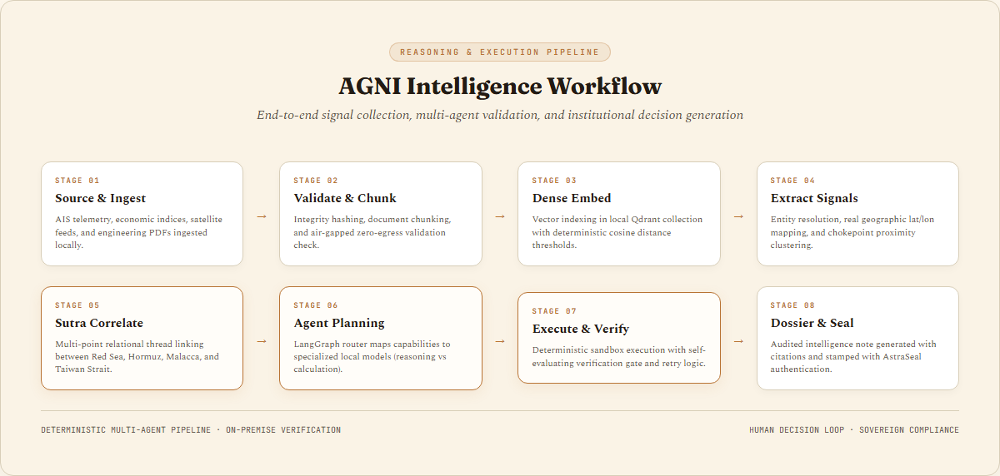

1. **Source & Ingest:** Multi-format technical data and satellite streams are ingested locally.
2. **Validate & Chunk:** SHA-256 integrity hashing and zero-egress policy enforcement.
3. **Dense Embed:** 384-dimensional vector indexing into Qdrant.
4. **Extract Signals:** Real geographic coordinate resolution and chokepoint entity recognition.
5. **Sutra Correlate:** Multi-point relational topological threads linking maritime trade chokepoints.
6. **Agent Planning:** Capability-based model routing (analytical reasoning vs deterministic calculation).
7. **Execute & Verify:** Isolated Python sandbox computation and 8-point automated constraint verification.
8. **Dossier & Seal:** Cryptographic audit trail synthesis stamped with the institutional AstraSeal.

---

## Global Intelligence Map

The **Global Signal Field** visualization is grounded in real-world geographic truth:

- **Cartographic Foundation:** Uses **Natural Earth** cartographic data (`world-110m.json`) rendered via D3's **Equal Earth projection** (`d3.geoEqualEarth`).
- **Equal-Area Projection:** Unlike conformal projections (such as Web Mercator) which severely distort polar regions, Equal Earth is an equal-area pseudocylindrical projection designed specifically for world thematic maps, preserving true relative landmass scale.
- **Geographic Coordinates:** Every signal node is positioned using real decimal latitude and longitude (e.g., Taiwan Strait at `[119.50°E, 24.00°N]`, Bab el-Mandeb at `[43.30°E, 12.60°N]`, Strait of Hormuz at `[56.30°E, 26.60°N]`).
- **Interactive Intelligence Drawer:** Clicking any hotspot opens an analytical briefing detailing immediate vessel density, transit deviation times, and strategic chokepoint impact.

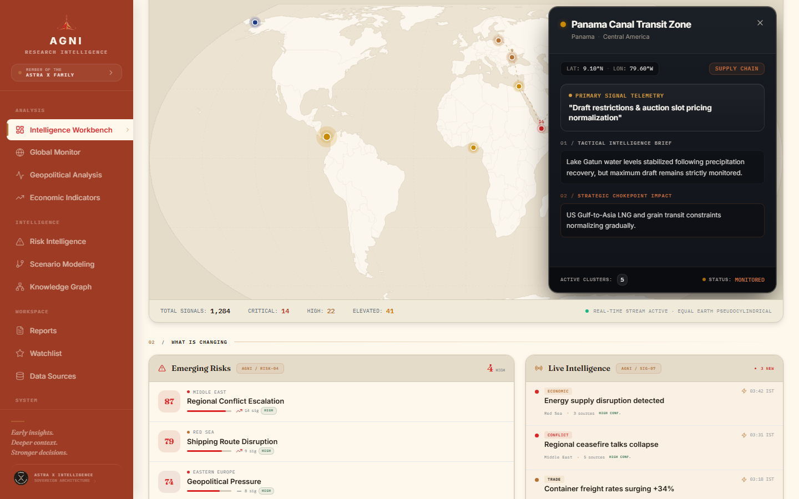

---

## AstraX Design System & Family Separation

AGNI belongs to the **AstraX** family of sovereign intelligence systems. The brand architecture enforces strict separation between product identity and parent institution:

- **Product Identity:** AGNI is presented solely as **AGNI Research Intelligence**. The main dashboard contains zero distracting menus or lists of other products.
- **Subtle Attribution:** Minimal, elegant attribution in the sidebar (`MEMBER OF THE ASTRA X FAMILY →`) and footer links directly to the parent ecosystem directory.
- **Dedicated Ecosystem Page (`/astrax`):** Standalone route showcasing the master AstraX visual identity, design grammar, and sibling systems (**KuberSetu**, **Vajra**, **Niyukti**, **Margadarshi**, **AGNI**, **Satyam**, **Vaidhya**).
- **The Six Pillars of AstraX Grammar:**
  1. **Bindu:** Coordinate origin and anchor point for reasoning wavefronts.
  2. **Sutra:** Relational structural threads connecting evidence citations and chokepoint corridors.
  3. **Grid:** Proportional layout mathematics derived from classical Indian geometric ratios.
  4. **Geometry:** Cardinal axes, 45-degree angle faceted sails, and telemetry satellite nodes.
  5. **Material:** Warm Ivory (`#FDF7EC`), Sandstone (`#EADCC8`), and Deep Ink (`#221B14`) tactile surfaces.
  6. **Color:** Restrained mineral palette featuring Agni Copper (`#B87333`), Astra Indigo (`#1E3A8A`), and Vermilion (`#DC2626`).

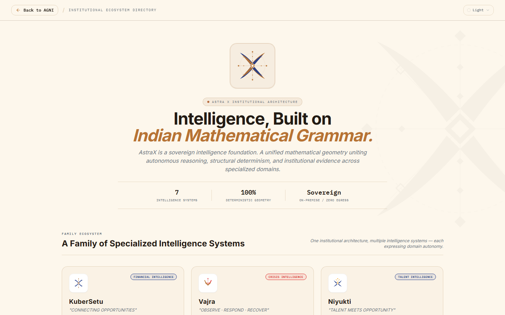

---

## Technology Stack

### Frontend Architecture
- **Framework:** React 18.3 (`react`, `react-dom`)
- **Language:** TypeScript 5.7
- **Build Tool:** Vite 5.4
- **Cartography:** D3 Geo 3.1 (`d3-geo`), TopoJSON Client 3.1 (`topojson-client`), World Atlas 2.0 (`world-atlas`)
- **Routing:** React Router DOM 7.9 (`react-router-dom`)
- **Styling:** Vanilla CSS Custom Property Design Tokens + Tailwind CSS 3.4
- **Icons:** Lucide React 0.475

### Backend Architecture
- **Framework:** FastAPI 0.115 + Uvicorn ASGI Server
- **Language:** Python 3.11+ / 3.14 compatible
- **Orchestration:** LangGraph (StateGraph, cyclical verification state machines)
- **Vector Database:** Qdrant Client 1.13 (Embedded disk storage)
- **Embeddings:** FastEmbed / Sentence-Transformers (`all-MiniLM-L6-v2`)
- **Document Understanding:** PyMuPDF (`fitz`), Python-Docx
- **Local Inference:** Ollama API (`llama3.1:8b`, `qwen2.5-coder:7b`)

---

## Project Structure

```text
d:\AGNI-AI
├── backend/
│   ├── app/
│   │   ├── agent/             # LangGraph state machine & executor
│   │   ├── api/               # FastAPI route controllers (tasks, models, security)
│   │   ├── config.py          # Central environment settings
│   │   ├── main.py            # ASGI application entrypoint
│   │   ├── models/            # Capability router & Ollama client
│   │   ├── rag/               # Vector ingestion & Qdrant semantic retrieval
│   │   └── sandbox/           # Isolated execution runtime
│   └── tests/                 # Unit & integration test suite (pytest)
├── data/
│   ├── raw/                   # Inspection PDFs, P&ID schematics, test assets
│   └── qdrant_storage/        # Local vector index directory
├── docs/
│   ├── architecture/          # Architecture diagrams (architecture.png)
│   ├── diagrams/              # System flowcharts (system-flow.png)
│   ├── screenshots/           # High-resolution application screenshots
│   ├── API.md                 # Complete REST API specification
│   ├── ARCHITECTURE.md        # Deep-dive architectural specification
│   └── SECURITY.md            # Air-gap security model & compliance
├── frontend/
│   ├── src/
│   │   ├── api/               # Typed REST API clients
│   │   ├── brand/             # Centralized tokens, AstraXMark, AgniLogo, AstraSeal
│   │   ├── components/        # Equal Earth map, Workbench, Hero, Navigation
│   │   ├── data/              # Natural Earth world-110m TopoJSON
│   │   ├── pages/             # AstraXFamilyPage (/astrax)
│   │   ├── types/             # Shared TypeScript schemas
│   │   ├── App.tsx            # Main AGNI intelligence workspace
│   │   ├── index.css          # Design tokens & responsive styles
│   │   └── main.tsx           # BrowserRouter entrypoint
│   ├── package.json           # Frontend dependencies
│   └── vite.config.ts         # Vite build configuration
├── docker-compose.yml         # Container orchestration
└── README.md                  # Institutional documentation
```

---

## Prerequisites

- **Node.js:** v18.0.0 or higher (v20+ recommended)
- **Python:** v3.11.0 or higher
- **Package Manager:** `npm` (v9+) or `pnpm`
- **Ollama Runtime (Optional for Live Inference):** Running on `http://127.0.0.1:11434` with `llama3.1:8b` and `qwen2.5-coder:7b` models pulled.
- **Git:** v2.30+

---

## Environment Variables

Configure application settings by copying `.env.example` to `.env`:

```bash
cp .env.example .env
```

| Variable | Default Value | Description |
| :--- | :--- | :--- |
| `APP_ENV` | `development` | Deployment environment (`development` / `production`) |
| `API_PORT` | `8000` | FastAPI server listening port |
| `OLLAMA_URL` | `http://127.0.0.1:11434` | Local Ollama runtime HTTP address |
| `QDRANT_STORAGE_PATH`| `./data/qdrant_storage` | Local directory for embedded Qdrant vector index |
| `AIR_GAPPED_MODE` | `true` | Enforces zero external network socket connections |
| `ENABLE_SANDBOX` | `true` | Restricts code execution inside isolated child processes |
| `MAX_VERIFIER_RETRIES`| `1` | Maximum adaptive retry passes for failed verification checks |

---

## Installation & Setup

### 1. Clone Repository
```bash
git clone https://github.com/maitray-agrawal/AGNI-AI.git
cd AGNI-AI
```

### 2. Backend Setup
```bash
# Create and activate virtual environment
python -m venv .venv
# Windows (PowerShell)
.venv\Scripts\Activate.ps1
# Linux / macOS
source .venv/bin/activate

# Install backend dependencies
pip install -r backend/requirements.txt
```

### 3. Frontend Setup
```bash
cd frontend
npm install
cd ..
```

---

## Development

Run both the FastAPI backend server and the Vite development server:

### Terminal 1: Backend Gateway
```bash
# From workspace root with activated venv:
python -m uvicorn backend.app.main:app --host 127.0.0.1 --port 8000 --reload
```
*Backend API available at: `http://127.0.0.1:8000/docs`*

### Terminal 2: Frontend Workspace
```bash
cd frontend
npm run dev
```
*Frontend Workspace available at: `http://127.0.0.1:5174/`*

---

## Docker Deployment

To launch the full stack in a containerized sovereign environment:

```bash
# Build and launch services
docker compose up -d --build

# View container logs
docker compose logs -f

# Teardown
docker compose down
```

---

## Production Build

To compile the production bundles:

```bash
cd frontend
npm run build
```

The production output will be generated cleanly in `frontend/dist/`.

---

## Application Screenshots

| View | Screenshot |
| :--- | :--- |
| **01. Main Dashboard** |  |
| **02. Autonomous Workbench** | 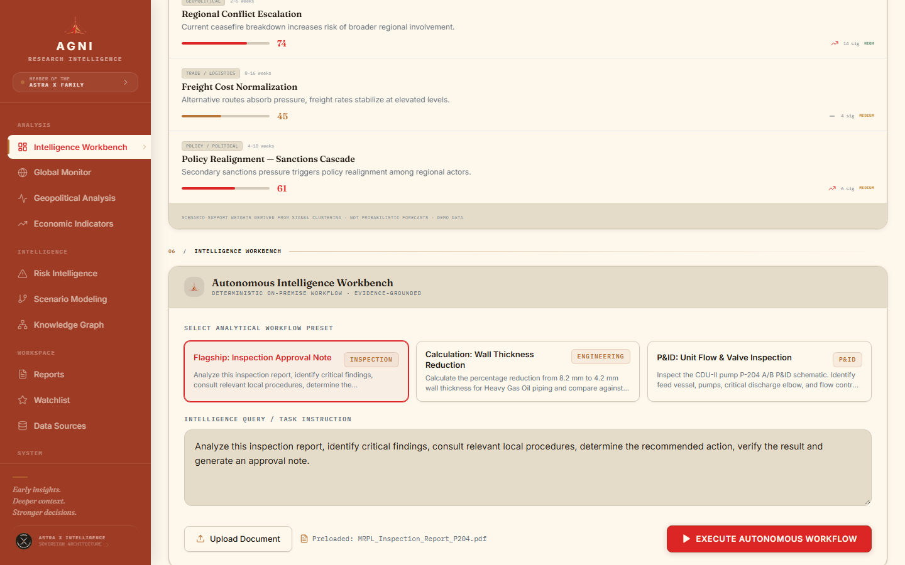 |
| **03. Equal Earth Map** |  |
| **04. Geopolitical Analysis** | 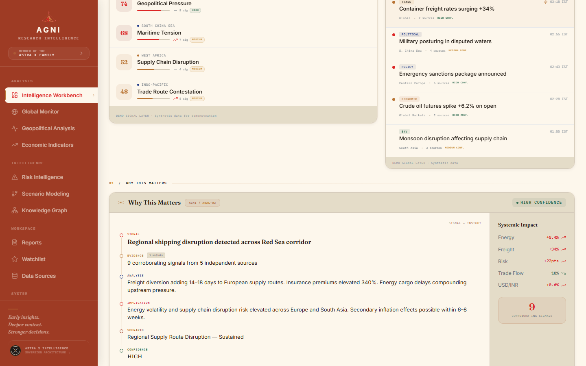 |
| **05. Risk Intelligence** | 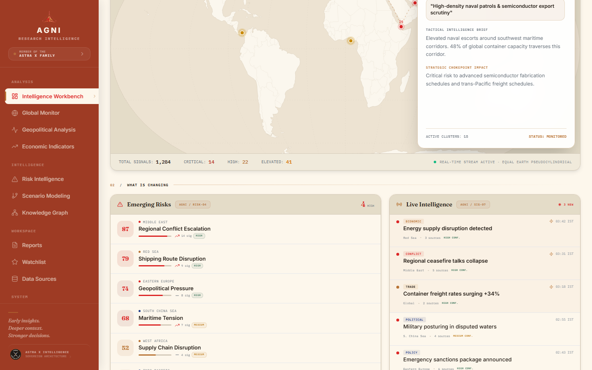 |
| **06. Scenario Modeling** | 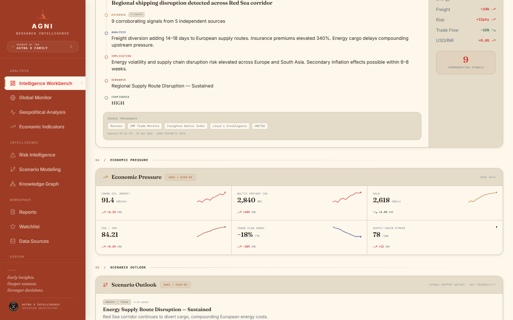 |
| **07. Knowledge Graph** | 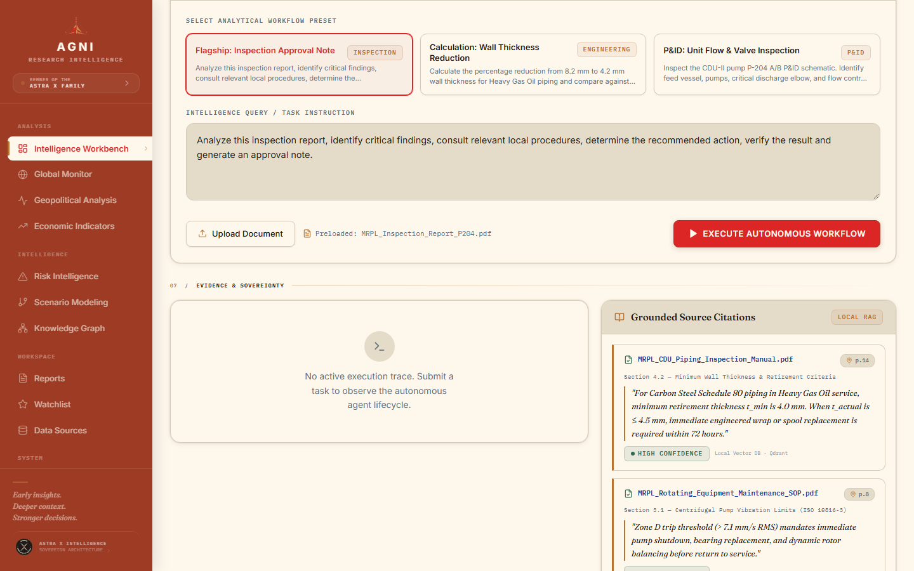 |
| **08. Dark Theme** | 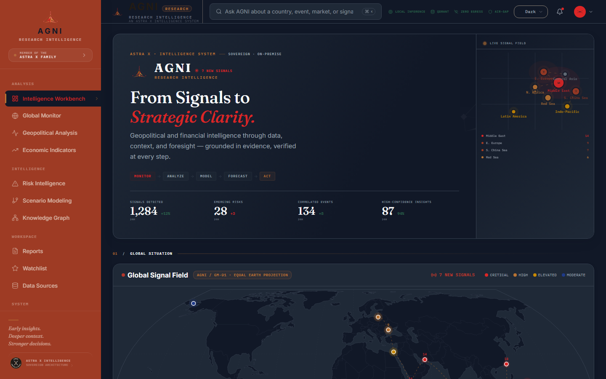 |
| **09. Sandstone Theme** | 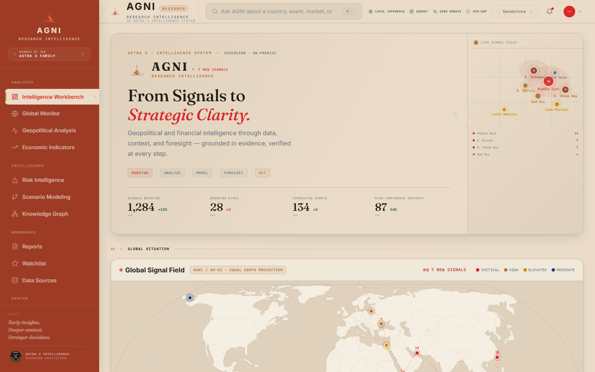 |
| **10. AstraX Family Page** |  |

---

## Verification & Technical Evidence

Every architectural claim is verifiable via reproducible automated test suites:

- **Frontend Compilation:** Verified via `npm run build` (`tsc && vite build`) — compiled cleanly with **0 errors**.
- **Automated Verification Suite:** Validated using Playwright scripts (`verify_family_separation.py`, `verify_map.py`):
  - Verified 0 sibling project names rendered on the AGNI main page.
  - Verified seamless navigation to `/astrax` and return via `"Back to AGNI"`.
  - Verified real Natural Earth country polygon rendering and signal hotspot projection.
- **Backend Test Suite:** Verified using `pytest backend/tests/ -q`:
  - 33 unit, schema, security, router, and failure-injection tests passing.

---

## Testing

Run the automated test suites:

```bash
# Run backend pytest suite
.venv\Scripts\pytest backend/tests/ -v

# Run frontend type checking & build validation
cd frontend
npm run build
```

---

## Known Limitations

- **Local Ollama Daemon:** Live neural inference requires a local instance of Ollama running on `http://127.0.0.1:11434`. If Ollama is offline, the workspace operates in deterministic degraded mode using pre-indexed knowledge.
- **High-Density Vector Storage:** The embedded Qdrant instance stores vectors on local disk; large document ingestion scales linearly with local storage IOPS.

---

## License

This project is licensed under the **Apache-2.0 License** — see the [LICENSE](LICENSE) file for details.
