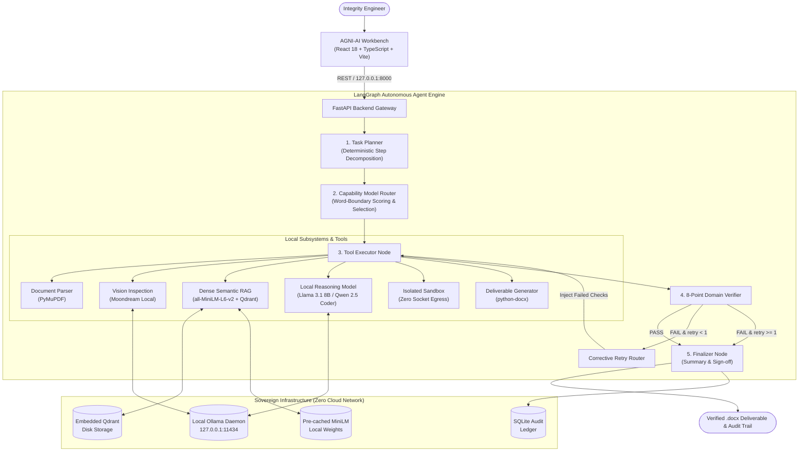

# AGNI-AI

> **Sovereign Agentic Intelligence for Evidence-Grounded Engineering Workflows**

Part of the **AstraX** project family.

AGNI-AI is a local-first agentic AI platform that combines multimodal document understanding, semantic retrieval, verification loops, isolated computation, and auditable decision generation without sending sensitive engineering data to external AI services.

---

## 1. Problem & Motivation

Critical engineering operations—such as refinery process units, offshore platforms, pipeline networks, and heavy chemical plants—rely heavily on confidential technical assets:
- Scanned Non-Destructive Testing (NDT) inspection reports and ultrasonic thickness logs
- Piping & Instrumentation Diagrams (P&IDs) and process flow schematics
- Standard operating procedures (SOPs), maintenance manuals, and equipment design limits
- Process telemetry, vibration measurements, and metallurgy degradation records

Modern commercial AI solutions typically require routing proprietary technical data through external cloud APIs. For critical infrastructure, this introduces severe challenges:
1. **Data Sovereignty Risks:** Industrial data and structural vulnerability details are exposed to third-party networks.
2. **Auditability Gaps:** Cloud LLMs provide non-deterministic responses without traceable internal states or execution ledgers.
3. **Unreliable Unverified Conclusions:** Complex maintenance decisions are generated without domain-specific deterministic checks.
4. **Weak Evidence Grounding:** Generic model responses lack explicit citation to facility operating standards.
5. **Unsafe Calculation Execution:** Unverified code or mathematical formulas run without security boundaries or sandbox isolation.

---

## 2. The Solution: Local-First Engineering Intelligence

AGNI-AI resolves these challenges through a sovereign, local-first architecture:
- **100% On-Premise Execution:** All neural inference (LLMs, vision models, dense vector embeddings) runs locally on workstation/server hardware with zero external AI provider dependencies.
- **Evidence-Grounded Semantic Retrieval:** Local documents are indexed into an embedded Qdrant vector database using `sentence-transformers/all-MiniLM-L6-v2` (384-dim, normalized L2 cosine similarity), citing exact document names, sections, and page numbers.
- **Verifier-Driven Agentic Execution:** Responses are never accepted blindly. A LangGraph state machine routes execution through an automated domain verifier that inspects tag consistency, allowable limit comparisons, citation grounding, and error states.
- **Adaptive Corrective Retry:** When verification checks fail, the specific failed criteria are injected directly into a revised model reasoning prompt (`[CORRECTION REQUIRED FROM PRIOR ATTEMPT]`) for a targeted second-pass synthesis.
- **Restricted Sandbox Computation:** Code execution and calculations run inside an isolated sandbox enforcing process-level network socket blocking and resource timeouts.
- **Degraded-Mode Observability:** If live document extraction tools encounter corrupted files or missing inputs, the system surfaces a clear `⚠ DEGRADED MODE` alert in the final summary and UI badges rather than silently masking reference values.
- **Deterministic Deliverable Generation:** Automated synthesis of formal engineering clearance documents (`.docx` Approval Notes) containing inspector signatures, citation tables, and cryptographic provenance.

---

## 3. System Architecture



---

## 4. Verifier-Driven Agent Loop

AGNI-AI implements a deterministic closed-loop verification workflow:

```text
       Task Received
             │
             ▼
     Autonomous Plan
             │
             ▼
       Capability Route
             │
             ▼
     ┌───────────────┐
     │  Execute Task │◄──────────────────────────┐
     └───────┬───────┘                           │
             │                                   │
             ▼                                   │
     ┌───────────────┐                           │
     │ Verify Output │                           │
     └───────┬───────┘                           │
             │                                   │
      ┌──────┴──────┐                            │
      │   Verdict   │                            │
      └──────┬──────┘                            │
             │                                   │
     ┌───────┴───────┐                           │
     │               │                           │
  [PASS]          [FAIL]                         │
     │               │                           │
     │         Retry Count < 1?                  │
     │          ├── YES ──► Inject Correction ───┘
     │          │           into Prompt
     │          └── NO ───┐
     │                    │
     ▼                    ▼
Finalize Deliverable   Finalize with Warnings
```

### Prompt Correction Injection Mechanism
When attempt 1 fails any verification condition (e.g., `critical_findings_identified`, `rag_evidence_cited`), the LangGraph state machine routes execution back to the executor node. The exact failure string is formatted into a deterministic correction block injected directly prior to the final recommendation instruction:

```text
[CORRECTION REQUIRED FROM PRIOR ATTEMPT]

The previous synthesis failed these verification checks:

critical_findings_identified, rag_evidence_cited

Specifically address and resolve each failed verification condition in this revised evaluation. Do not merely repeat the previous synthesis.
```

---

## 5. Technology Stack

| Layer | Technology | Purpose |
| :--- | :--- | :--- |
| **Frontend** | React 18, TypeScript, Vite, Tailwind CSS, Lucide Icons | Sovereign desktop-first workbench UI |
| **Backend API** | Python 3.11, FastAPI, Pydantic v2, Uvicorn | Local REST API and file streaming |
| **Orchestration** | LangGraph (`StateGraph`), TypedDict AgentState | Cyclic agent state machine with verifier edges |
| **Local LLMs** | Ollama local daemon (`127.0.0.1:11434`) | `llama3.1:8b`, `qwen2.5-coder:7b`, `mistral:latest` |
| **Local Vision** | Local multimodal model (`moondream`) | Scanned inspection tables and P&ID schematic inspection |
| **Embeddings** | `sentence-transformers/all-MiniLM-L6-v2` | 384-dimensional dense semantic vectors (local CPU) |
| **Vector Store** | Embedded Qdrant (`qdrant-client` local storage) | Disk-backed vector storage with versioned staged migration |
| **Code Sandbox** | Process-level socket isolation, timeout guard | Secure calculation execution with network blocking |
| **Document Processing** | PyMuPDF (`fitz`), `python-docx` | PDF extraction and official `.docx` deliverable creation |
| **Audit Ledger** | SQLite, OS telemetry inspection (`psutil`) | Immutable task execution logs and socket auditing |
| **Testing** | pytest, pytest-asyncio, httpx | 37-test automated verification suite |

---

## 6. Verified Test Suite & Validation Results

All claims in this repository are verified by automated tests running against actual component boundaries without mocking internal execution logic:

```powershell
.\.venv\Scripts\python.exe -m pytest backend/tests/ -v
```

### Full Regression Suite: 37 / 37 Passed (100%)

| Test Module | Tests | Status | Scope |
| :--- | :---: | :---: | :--- |
| `test_agent_models_unit.py` | 4 | **PASSED** | Model registry specs, fallback chains, scoring, schema validation |
| `test_api.py` | 4 | **PASSED** | FastAPI endpoints (`/api/health`, `/api/models`, `/api/security/status`, `/api/tasks/run`) |
| `test_failure_injection.py` | 8 | **PASSED** | Connection errors, timeouts, missing models, vision fallback blocks, verifier rejections |
| `test_flagship_workflow.py` | 1 | **PASSED** | End-to-end inspection PDF -> vision -> RAG -> reasoning -> verifier -> DOCX |
| `test_inspection_hardening.py` | 3 | **PASSED** | Real prompt-capture test, live LangGraph retry test, degraded mode surfacing test |
| `test_retry_loop.py` | 2 | **PASSED** | LangGraph adaptive retry on verifier failure, single-retry maximum cap protection |
| `test_sandbox.py` | 2 | **PASSED** | Isolated calculation execution and socket network blocking verification |
| `test_sandbox_integration.py` | 2 | **PASSED** | Live agent-to-sandbox code execution and extraction error propagation |
| `test_semantic_embeddings.py` | 9 | **PASSED** | 384-dim normalization, cosine similarity, offline enforcement, atomic Qdrant staged migration |
| `test_vertical_poc.py` | 2 | **PASSED** | Vertical slice technical reasoning and isolated mathematical calculation |

### Dedicated Semantic & Vector Suite: 9 / 9 Passed

```powershell
.\.venv\Scripts\python.exe -m pytest backend/tests/test_semantic_embeddings.py -v
# Result: 9 passed in 20.78s
```

---

## 7. Quickstart Guide

### Prerequisites
- Windows 10/11 or Linux
- Python 3.11 (`.venv`)
- Node.js 18+ and npm
- [Ollama](https://ollama.ai) installed and running locally with models pulled:
  ```powershell
  ollama pull llama3.1:8b
  ollama pull qwen2.5-coder:7b
  ollama pull moondream
  ollama pull mistral:latest
  ```

### 1. Backend Service
```powershell
.\.venv\Scripts\python.exe -m uvicorn backend.app.main:app --host 127.0.0.1 --port 8000
```
Verify health:
```powershell
curl.exe http://127.0.0.1:8000/api/health
```

### 2. Frontend Workbench
```powershell
cd frontend
npm install
npm run dev -- --host 127.0.0.1 --port 5173
```
Open your browser at `http://127.0.0.1:5173`.

### 3. Run Standalone Offline Demo
```powershell
.\.venv\Scripts\python.exe scripts/demo_run.py
```

---

## 8. Sovereign Telemetry & Security Guarantees

- **Enforced Loopback:** Backend binds strictly to `127.0.0.1`.
- **Zero Cloud Network Calls:** Local inference calls route strictly to `127.0.0.1:11434`. No external API keys or cloud tokens are configured or required.
- **Air-Gapped Dense Embeddings:** `all-MiniLM-L6-v2` executes from pre-cached weights with `HF_HUB_OFFLINE=1` and `TRANSFORMERS_OFFLINE=1`.
- **Network-Isolated Sandbox:** The code sandbox intercepts socket creation attempts, preventing generated scripts from attempting outbound connections.
- **Rollback-Protected Vector Migration:** Vector store updates use isolated staging collections, validating dimensions and cosine probes before atomically switching collection aliases.
